# On-Behalf-Of flow (OBO flow) with Azure AI Agent MCP Deployment Guide
In this guide, we will walk you through the steps to deploy a FastAPI application on Azure App Service, configure Easy Auth for authentication, set up Azure API Management (API-M) with On-Behalf-Of (OBO) flow, and finally deploy an Azure AI Foundry agent that interacts with the API via MCP.

## 🚀 The On-Behalf-Of (OBO) Flow

```mermaid
sequenceDiagram
    participant App
    participant IdP
    participant API-M
    participant Backend API

    App->>API-M: ① User authentication<br/>App sends access token A to<br/>API-M.
    
    API-M->>IdP: ② API-M requests an Backend API<br/>access token to IdP with<br/>token A, client ID, and client<br/>secret.
    
    IdP->>API-M: ③ IdP returns access token B.
    
    API-M->>Backend API: ④ Attach access token B as a<br/>bearer token to the HTTP<br/>header and call Backend API.
    
    Backend API->>API-M: ⑤ API-M receives a response<br/>from the protected resource<br/>(Backend API).
    
    API-M->>App: ⑥ API-M returns a response<br/>to App.
```


## 🏗️ The architecture involves the following components:
1. **Azure App Service**: Hosts the FastAPI application which provides endpoints to retrieve Microsoft
2. **Azure API Management (API-M)**: Acts as a gateway to the App Service, handling authentication and OBO flow.
3. **Azure AI Foundry Agent**: An AI agent that uses MCP to interact with the API-M and fetch data on behalf of the user.


## 📁 Sample Code Repository
The sample code for this deployment can be found in the following GitHub repository:
- [where-is-my-org/obo-api](https://github.com/where-is-my-org/obo-api.git)
- [where-is-my-org/chat-with-ai-agent](https://github.com/where-is-my-org/chat-with-ai-agent.git)


## ☁️ Azure App Service 

### 1. 🛠️ Provision Configuration

#### 1-1. 🌐 Navigate to Azure Portal
- Open https://portal.azure.com
- Sign in with your Azure account
- Click "Create a resource" or search for "App Service"

#### 1-2. ⚙️ Basic Configuration Tab
Fill in the following fields:
- Resource Group: `named-by-yourself`
- Name: Enter `named-by-yourself`
- Publish: Select **Code**
- Runtime stack: **Python 3.13**
- Region: Select Southeast Asia
- Linux Plan: Create new `named-by-yourself`
- Pricing tier: **Premium V3 P0V3**

#### 1-3. 🌐 Networking Tab
Set network access configuration:
- Enable public access: Keep **On** (default)
- Enable virtual network integration: Keep **Off** (default)

#### 1-4. 📦 Deployment Tab
- Continuous deployment: Keep **Disable** (default)

### 2. 🔧 Post-Deployment Portal Configuration
- Navigate to Settings > Configuration > Stack Settings
    - Startup Command: `gunicorn -w 2 -k uvicorn.workers.UvicornWorker -b 0.0.0.0:8000 main:app`
- Click **Restart** to apply the changes

### 3. 📤 Deploy Source Code to Azure App Service
- Confirm the service is woking properly at local before provisioning
- Click "Azure" in VS Code Extensions and login to your Azure account
- Under Resources, find your App Service
- Right-click the App Service and select "Deploy to Web App..."
- Select the folder containing your source code and confirm the deployment when prompted

### 4. 🔐 Easy Auth Configuration

#### 4-1. 🛡️ Easy Auth Setup on Azure App Service
- Navigate to Settings > Authentication
- Click **Add identity provider**
- Select **Microsoft** as the identity provider
    - **Workforce configuration (current tenant)**
    - **App registration type**: 
        - Select **Pick an existing app registration in this directory** if you have an existing registration
    - **Client secret expiration**: Set to **365 days (12 months)** or as per your security requirements
    - **Issuer URL**: `https://login.microsoftonline.com/{tenant-id}/v2.0`
- Client application requirement: 
    - Choose **Allow requests from specific client applications**
    - Input the Application (Client) ID of your registered application and registed application of API-M
- Leave Identity requirement and Tenant requirement as default

#### 4-2. 📋 Easy Auth Setup for Registered Application
- Navigate to **Authentication** and ensure the following settings:
    - Click Add a platform > Web
        - Redirect URIs: Add the following URIs
            - `https://{your-app-service-name}.azurewebsites.net/.auth/login/aad/callback
        - Select **Access tokens** and **ID tokens** under Implicit grant and hybrid flows
        - Click **Configure** to save
    - Also add one more redirect URIs, Select **Add URI** under Redirect URIs to add:
        - `https://{your-app-service-name}`
- Navigate to **API permissions**, ensure the following permissions are granted:
    - **Microsoft Graph (6)** - All as **Delegated** type:
        - `email`
        - `offline_access`
        - `openid`
        - `profile`
        - `User.Read`
        - `User.ReadBasic.All`
    - **Your backend API (1)** - All as **Delegated** type:
        - `user_impersonation`
    - After assigning the permissions, click on **Grant admin consent for {your-tenant-name}** and confirm when prompted
- Navigate to **Expose an API**
    - Click on **Add a scope**, set the following values and click **Add scope** to save:
        - **Scope name**: `user_impersonation`
        - **Who can consent?**: Admins and users
        - **Admin consent display name**: `Access OBO
        - **Admin consent description**: `Allows the app to access OBO on behalf of the signed-in user`
    - Under **Authorized client application**
        - Click on **Add a client application**
        - Input the Application (Client) ID of your registered application of API-M
        - Check the box for **user_impersonation** scope
        - Click **Add application** to save
- Navigate to ***Mainfest*
    - Search for `requestedAccessTokenVersion` and set its value to `2` (Microsoft Graph App Manifest (New))
    - Search for `AccessTokenAcceptedVersion` and set its value to `2` (AAD Graph App Manifest (Deprecating Soon))
- Confirm Easy Auth is working properly by accessing the App Service URL and verifying token is correctly issued
    - Open the browser and navigate to the App Service URL with `/msft/headers` appended (e.g., `https://your-app-service-url/msft/header`)
    - Find the `X-MS-TOKEN-AAD-ACCESS-TOKEN` header in the response to verify that the token is correctly issued
    - You can decode the token using [jwt.ms](https://jwt.ms/) to inspect its contents


## 🎯 Azure API Management

### 1. 📊 Set APIs
- Navigate to your API Management instance in the Azure Portal, click on "APIs" from the left-hand menu
- Click on "+ Add API" and select "Http"
- Fill in the following fields:
    - Display name: `named-by-yourself`
    - Name: `named-by-yourself`
    - Web service URL: Enter the URL of your Azure App Service (e.g., `https://your-app-service-url/msft`)
    - API URL suffix: `msft` (optional)
    - Description: `This is API service that provides comprehensive Microsoft Corporation information through RESTful API endpoints. The application serves as a mock data service offering both financial stock data and product portfolio information.`
    - Click "Create" to add the API
- Click on the newly created API to configure it further
    - Select "Add Operation" to define the endpoints
    - Fill in the following fields for each operation:
        - Display name: `named-by-yourself`
        - Name: `named-by-yourself`
        - URL template: `/headers` (or other endpoint paths)
        - Method: `GET` (or other HTTP methods as needed)
        - Description: `This endpoint returns all the HTTP header data provided by the user without omitting anything.`
    - Click "Save" to add the operation
- Test the API by navigating to the "Test" tab within the API Management portal
    - Select the operation you want to test
    - Click "Send" to make a request to your Azure App Service through API Management
    - Since Easy Auth is configured, the request should be authenticated, and you should receive an Unauthorized response from your App Service

### 2. 🔄 Update API-M Registered Application
- Navigate to Azure Active Directory > App registrations, find your registered application of API-M
- Navigate to **API permissions**, ensure the following permissions are granted:
    - **Microsoft Graph (6)** - All as **Delegated** type:
        - `email`
        - `offline_access` 
        - `openid`
        - `profile`
        - `User.Read`
        - `User.ReadBasic.All`
    - **APIs my organiztion users** and select your backend API:
        - `user_impersonation`
    - After assigning the permissions, click on **Grant admin consent** and confirm when prompted
- Navigate to **Expose an API**
    - Click on **Add a scope**, set the following values and click **Add scope** to save:
        - **Scope name**: `user_impersonation`
        - **Who can consent?**: Admins and users
        - **Admin consent display name**: `Access OBO
        - **Admin consent description**: `Allows the app to access OBO on behalf of the signed-in user`
    - Under **Authorized client application**
        - Click on **Add a client application**
        - Input the Application (Client) ID of your registered application of Azure AI Foundry and AZ CLI
            - Find the Application (Client) ID in Azure Active Directory of Azure AI Foundry used registration application
            - AZ CLI use the Application (Client) ID: `04b07795-8ddb-461a-bbee-02f9e1bf7b46`
        - Check the box for **user_impersonation** scope for both applications
        - Click **Add application** to save
- Navigate to ***Mainfest*
    - Search for `requestedAccessTokenVersion` and set its value to `2` (Microsoft Graph App Manifest (New))
    - Search for `AccessTokenAcceptedVersion` and set its value to `2` (AAD Graph App Manifest (Deprecating Soon))

### 3. 🔧 Set Up OBO Flow in Policy
- Navigate to **Named values** under APIs and create new variables needed:
    - `APIMClientId`: Application (Client) ID of your registered application of API-M
    - `APIMClientSecret`: Client Secret of your registered application of API-M
- Select the API you created earlier and naviagte to "inbound processing"
- Click `policy </>` and replcae the `<inblund> ... </inbound>` section with the following code snippet:
    ```xml
        <!-- - Policies are applied in the order they appear. - Position <base/> inside a section to inherit policies from the outer scope. - Comments within policies are not preserved. -->
        <!-- Add policies as children to the <inbound>, <outbound>, <backend>, and <on-error> elements -->
        <policies>
            <!-- Throttle, authorize, validate, cache, or transform the requests -->
            <inbound>
                <base />
                <validate-jwt header-name="Authorization" failed-validation-httpcode="401">
                    <openid-config url="https://login.microsoftonline.com/<your-tenant-id>/v2.0/.well-known/openid-configuration" />
                    <required-claims>
                        <claim name="aud" match="all">
                            <value>your-api-m-client-id</value>
                        </claim>
                    </required-claims>
                </validate-jwt>
                <!--Acquire user access token and store it -->
                <set-variable name="UserToken" value="@(((String)context.Request.Headers["Authorization"][0]).Substring(7))" />
                <!--Acquire OBO token -->
                <send-request ignore-error="true" timeout="20" response-variable-name="oboResponse" mode="new">
                    <set-url>https://login.microsoftonline.com/<your-tenant-id>/oauth2/v2.0/token</set-url>
                    <set-method>POST</set-method>
                    <set-header name="Content-Type" exists-action="override">
                        <value>application/x-www-form-urlencoded</value>
                    </set-header>
                    <set-body>@{ return "grant_type=urn:ietf:params:oauth:grant-type:jwt-bearer&client_id={{APIMClientId}}&client_secret={{APIMClientSecret}}" + "&assertion=" + (string)context.Variables["UserToken"] + "&scope=api://<your-backend-api-client-id>/.default&requested_token_use=on_behalf_of"; }</set-body>
                </send-request>
                <!--Set the bearer token -->
                <set-header name="Authorization" exists-action="override">
                    <value>@("Bearer " + (String)((IResponse)context.Variables["oboResponse"]).Body.As<JObject>()["access_token"])</value>
                </set-header>
            </inbound>
            <!-- Control if and how the requests are forwarded to services -->
            <backend>
                <base />
            </backend>
            <!-- Customize the responses -->
            <outbound>
                <base />
            </outbound>
            <!-- Handle exceptions and customize error responses -->
            <on-error>
                <base />
            </on-error>
        </policies>
    ```
- 🧪 To successfully test the API, you need to obtain an access token from Azure AD and include it in the request headers
    - use az cli command as below to get the access token
        ```
        az account get-access-token --resource api://<api-m app id>
        ```
- Use the obtained access token to make requests to the API through API Management
    - Include the token in the `Authorization` header as a Bearer token (e.g., `Authorization: Bearer <access_token>`)

### 4. 🌐 Expose API as MCP Server
- Navigate to your API Management instance in the Azure Portal, click on "MCP Server (Preview)" from the left-hand menu
- Click on "+ Create MCP Server" and select "Expose an API as an MCP server" and fill in the following fields:
        - API: Select the API you created earlier from the dropdown menu
        - API Operation: Select all operations to be exposed
        - Display name: `named-by-yourself`
        - Name: `named-by-yourself`
        - Description: `Provides information about mock data of financial stock data and product portfolio information of MSFT. Also, query user information from request header.`

### 5. ⚡ Quick Test with GitHub Copilot
- Open `.github/mcp.json` and click "Add Server", choose "HTTP"
- Fill in the Server URL which get from API-M MCP Server page
- Add the following to `Authorization` header to MCP Server:
    ```json
    "playground": {
        "url": "https://<api-m-uri>/<mcp-name>/mcp",
        "type": "http",
        "headers": {
            "Ocp-Apim-Subscription-Key": "${input:user_key}",
            "Authorization": "Bearer ${input:AccessToken}"
        }
    }
    ```
- 🔑 Get `Ocp-Apim-Subscription-Key` from API-M
    - Navigate to your API Management instance in the Azure Portal, click on "Subscriptions" from the left-hand menu
    - From the Display named `Built-in all-access subscription` click **...** on it to view **Show/hide keys**
    - Copy the Primary key value


## 🤖 Azure AI Foundry Agent Deployment

### 🏗️ 1. Create a New Agent via azure-ai-agents SDK
- Open the sample code named `chat-with-ai-agent` workspace
- Follw the instruction in `README.md` to install the required dependencies and set up the environment variables
    - You will need to set the following environment variables in the `.env` file:
        - `PROJECT_ENDPOINT`: You can get it from Azure AI Foundry portal on **Overview** page with **Azure AI Foundry project endpoint** field
        - `MCP_SERVER_URL`: The MCP server URL from API-M MCP Server page
        - `APIM_KEY`: The `Ocp-Apim-Subscription-Key` obtained from API-M
- Run the file `create_agent.py` to create a new agent with the following code snippet:
    ```bash
    python create_agent_with_mcp_tools.py
    ```
- Confirm the agent is created successfully in Azure AI Foundry portal and note the Agent ID, replace it in the `.env` file

### 📝 2. Update Instructions for the Agent
- Navigate to the Azure AI Foundry portal and open your created agent previously
- Update the instructions for the agent with the following content:
    ```
    You are an agent that can obtain information about Microsoft (MSFT) products, stock prices and user request header through MCP. You must always retrieve data through MCP and never generate answers on your own.  Also, you can get user information and HTTP request header via MCP tools.

    ## Core Rules
    - All responses must first fetch data through MCP.
    - You are strictly forbidden from answering any user question using your own knowledge or assumptions.
    - Never answer without tool results.
    - When calling MCP, you must use On-Behalf-Of (OBO) authentication to ensure the query runs under the end user’s identity and permissions.

    ## Available MCP Tools
    - get_headers: Retrieve user HTTP request. You can know user's identity.
    - get_msft_stock: Retrieve Microsoft stock price information
    - get_msft_product: Retrieve Microsoft product information and rankings


    ## Interaction Rules with User
    - Do not mock or fabricate response data.
    - If no data can be fetched from MCP, respond with: "No data available."
    - If an error occurs while accessing MCP, return the exact error message encountered during the connection attempt.
    - If no incoming HTTP request, return "No HTTP data available." Do not mock anything data to response to user.
    ```

### 🧪 3. Test the Agent with Sample Code
- Create new threads and interact with the AI agent by running:
    ```bash
    python new_thread_with_agent.py
    ```
- You will get responses from the agent based on the data fetched from MCP via API-M as below:
    ```
    Get current agent (asst_xxxx).
    Created thread, ID: thread_xxxx
    Created message, ID: msg_xxx
    ========================================================================
    Starting authentication...

    ....
    ....

    Successfully obtained access token.
    ========================================================================
    Input allowed tools: ['getHeaders'], url: https://xxx
    Agent allowed tools: ['mcp']

    ...
    ...

    MCP Tool calls:
        Tool Call ID: call_xxx
        Type: mcp

    ========================================================================

    Conversation:
    --------------------------------------------------
    USER: Who am I?
    --------------------------------------------------
    ASSISTANT: You are identified as "xxxx" with the client principal ID "xxxx". Your IP address is x.x.x.x.
    --------------------------------------------------

    Demonstrating dynamic tool management:
    Current allowed tools: ['getHeaders']
    ```
